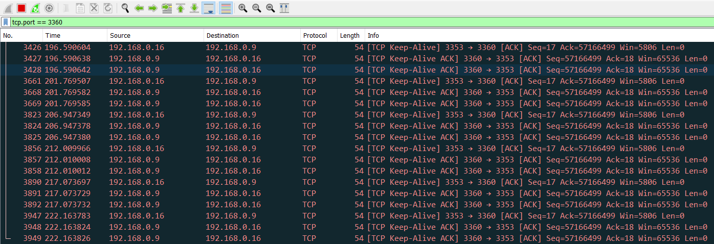
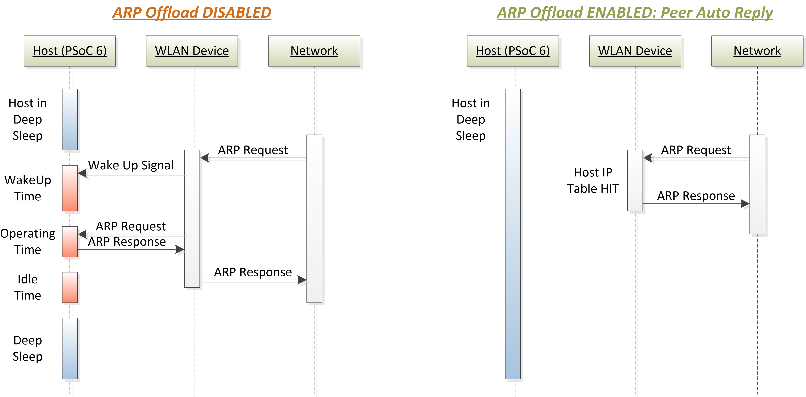
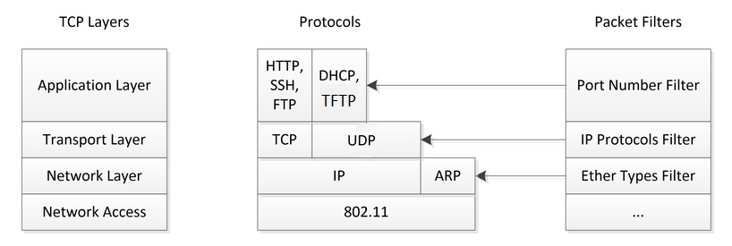
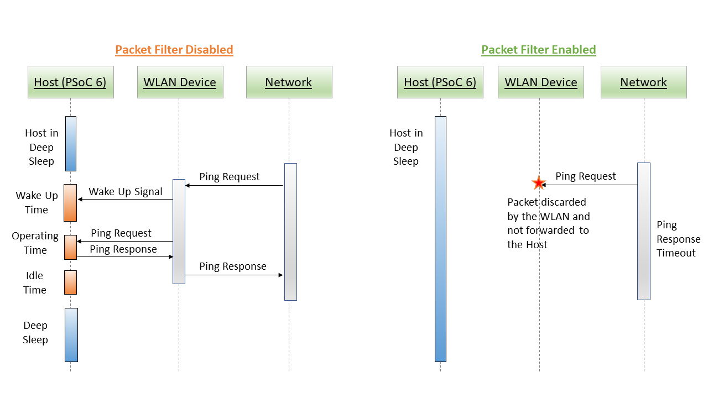
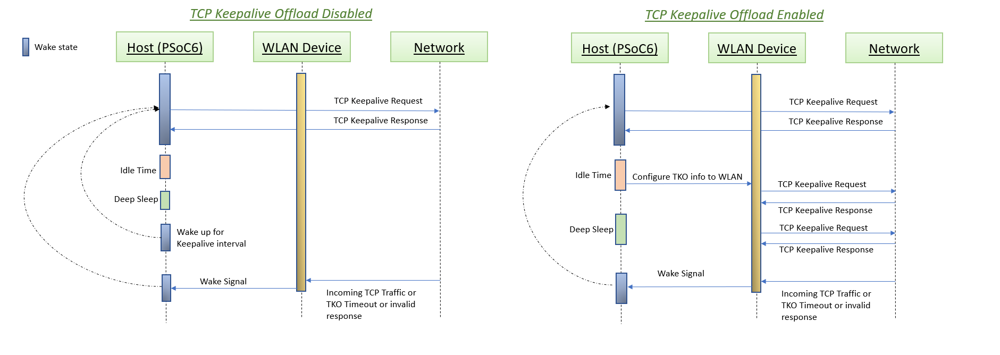
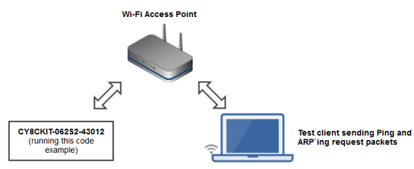

# AWS IoT and FreeRTOS for PSoC 6 MCU: WLAN Offloads

This code example demonstrates various WLAN offloads such as Address Resolution Protocol (ARP) offload, packet filter offload, and the TCP keepalive offload using the [Low Power Assistant (LPA) middleware](https://github.com/cypresssemiconductorco/lpa).

[Provide feedback on this Code Example.](https://cypress.co1.qualtrics.com/jfe/form/SV_1NTns53sK2yiljn?Q_EED=eyJVbmlxdWUgRG9jIElkIjoiQ0UyMzA1MDAiLCJTcGVjIE51bWJlciI6IjAwMi0zMDUwMCIsIkRvYyBUaXRsZSI6IkFXUyBJb1QgYW5kIEZyZWVSVE9TIGZvciBQU29DIDYgTUNVOiBXTEFOIE9mZmxvYWRzIiwicmlkIjoicHJhaCIsIkRvYyB2ZXJzaW9uIjoiMS4xLjAiLCJEb2MgTGFuZ3VhZ2UiOiJFbmdsaXNoIiwiRG9jIERpdmlzaW9uIjoiTUNEIiwiRG9jIEJVIjoiSUNXIiwiRG9jIEZhbWlseSI6IlBTT0MifQ==)

## Requirements

- [ModusToolbox v2.1](https://www.cypress.com/documentation/software-and-drivers/modustoolbox-software-archives)
- Programming Language: C
- [ModusToolbox Amazon FreeRTOS SDK](https://github.com/cypresssemiconductorco/amazon-freertos)
- [Cypress Programmer](https://www.cypress.com/products/psoc-programming-solutions)
- Associated Parts: All [PSoC® 6 MCU](http://www.cypress.com/PSoC6) parts with Amazon FreeRTOS support

If you are using CMake, ensure that you have the following installed. This code example was tested with CMake version 3.15.3 and Ninja version 1.9.0.

- [CMake](https://cmake.org/download/)
- [Ninja](https://ninja-build.org/)

## Supported Toolchains (make variable 'TOOLCHAIN')

- GNU Arm Embedded Compiler v7.2.1 (GCC_ARM) - Default value of `TOOLCHAIN`
- Arm compiler v6.11 (ARM)
- IAR C/C++ compiler v8.42.2 (IAR)

## Supported Kits (make variable 'TARGET')

- [PSoC 6 Wi-Fi BT Prototyping Kit](https://www.cypress.com/CY8CPROTO-062-4343W) (CY8CPROTO-062-4343W) - Default value of `TARGET`
- [PSoC 62S2 Wi-Fi BT Pioneer Kit](https://www.cypress.com/CY8CKIT-062S2-43012) (CY8CKIT-062S2-43012)
- [PSoC 6 Wi-Fi BT Pioneer Kit](https://www.cypress.com/CY8CKIT-062-WiFi-BT) (CY8CKIT-062-WIFI-BT)

## Hardware Setup

This example uses the board's default configuration. See the kit user guide to ensure that the board is configured correctly.

**Note:** The PSoC 6 BLE Pioneer Kit (CY8CKIT-062-BLE) and the PSoC 6 WiFi-BT Pioneer Kit (CY8CKIT-062-WIFI-BT) ship with KitProg2 installed. The ModusToolbox software requires KitProg3. Before using this code example, make sure that the board is upgraded to KitProg3. The tool and instructions are available in the [Firmware Loader](https://github.com/cypresssemiconductorco/Firmware-loader) GitHub repository. If you do not upgrade, you will see an error like "unable to find CMSIS-DAP device" or "KitProg firmware is out of date".

## Software Setup

- Install a terminal emulator if you don't have one. Instructions in this document use [Tera Term](https://ttssh2.osdn.jp/index.html.en).

- Install [Wireshark](https://www.wireshark.org/download.html) for capturing network packets over the air.

- Install the *ARP'ing* network utility:
  - [Windows OS](https://www.elifulkerson.com/projects/arp-ping.php)
  - [macOS](http://macappstore.org/arping/)
  - On Linux, use the `sudo apt install arping` command. Most of the Ubuntu OS distributions have it natively available.

- Install a Python interpreter if you don't have one. This code example is tested with [Python 3.8.3](https://www.python.org/downloads/release/python-383/).

## Using the Code Example

### First Steps:

The first three steps in this section are a one-time activity. These steps clone the Amazon FreeRTOS repository, check out the specified branch, and then finally clone this code example.

1. Clone the Amazon FreeRTOS from [GitHub](https://github.com/cypresssemiconductorco/amazon-freertos). The following command also clones all the submodules.

   ```
   git clone https://github.com/cypresssemiconductorco/amazon-freertos.git -b 202007-MTBAFR2041 --recurse-submodules
   ```

2. Go to the *<amazon-freertos>/projects/cypress* directory. Clone or download this code example, or copy it if you already have it.

   ```
   git clone https://github.com/cypresssemiconductorco/afr-example-wlan-offloads.git
   ```

   Alternatively, clone the example outside the *amazon-freertos* directory, but make sure that `AFR_PATH` and `CY_AFR_ROOT` are set correctly in *CMakeLists.txt* and *Makefile* respectively. 
   
   If you use Eclipse IDE for ModusToolbox, you must clone the code example under the *\<amazon-freertos>/projects/cypress* directory because Eclipse project files use relative paths to link to the files under *\<amazon-freertos>*.

3. Go to the *<amazon-freertos>/projects/cypress/afr-example-wlan-offloads* directory. Modify the `WIFI_SSID`, `WIFI_PASSWORD`, and `WIFI_SECURITY` macros to match the credentials of the Wi-Fi network that you want to connect to. These macros are defined in the *wifi_config.h* file.

   **Note:** See the AP's configuration page for the security type. See the `WIFISecurity_t` enumeration in *iot_wifi.h* to pass the corresponding security type in the `WIFI_SECURITY` macro.

4. This code example supports two ways of configuring LPA offloads: using the Device Configurator or using the user-defined configuration in code. This is selected using the `USE_CONFIGURATOR_GENERATED_CONFIG` macro in the *wlan_offload.h* file. By default, this macro is enabled, which means that the configuration from the Device Configurator is selected.

   Open the *design.modus* file present inside the *COMPONENT_CUSTOM_DESIGN_MODUS/TARGET_\<kit>* directory using the following command and modify the TCP keepalive offload connection parameters such as *Source Port*, *Destination Port*, and *Destination IP Address* in the **Wi-Fi - Parameters** tab to match your remote TCP server settings.

   ```
   make config TARGET=CY8CPROTO-062-4343W
   ```

5. Open a command shell and run the Python TCP server (*tcp_server.py*) in the code example directory. 

   On Linux and macOS, you can use any terminal application. On Windows, navigate to the modus-shell directory (*{ModusToolbox install directory}/tools_\<version>/modus-shell*) and run *Cygwin.bat*.

   The Python script starts a TCP server; the server then starts listening for incoming TCP connections.

   **Note:** The default port number is defined as `50007` in the *tcp_server.py* script. Specify a custom port number between 1 and 65535 that you would like to use:

   ```
   python tcp_server.py --port 3360
   ```
   where `3360` is the port number of the TCP server (destination port number), which has been already configured in the Device Configurator.

   **Note:** Ensure that the firewall settings of your computer allow access to the Python software so that it can communicate with the TCP client. See this [community thread](https://community.cypress.com/thread/53662).

6. Connect the board to your PC using the provided USB cable through the KitProg3 USB connector.

7. Open a terminal program and select the KitProg3 COM port. Set the serial port parameters to 8N1 and 115200 baud.

### In Eclipse IDE for ModusToolbox:

1. Go to **File** > **Import**.

2. Choose **Existing Projects into Workspace** under **General** and click **Next**. 

3. Click the **Browse** button near **Select root directory**, choose the CE folder *\<amazon-freertos>/projects/cypress/afr-example-wlan-offloads*, and click **Finish**. 

4. Select the application project in the Project Explorer.

5. In the **Quick Panel**, scroll down, and click **afr-example-wlan-offloads Program (KitProg3)**.

To program a target board different from the default one defined using the `TARGET` variable in the Makefile, you need to generate the launch configurations for the new target. See [Running FreeRTOS Code Examples - KBA228845](https://www.cypress.com/KBA228845) for details.

### Using Make Command Line Interface (CLI):

1. Go to the *<amazon-freertos>/projects/cypress/afr-example-wlan-offloads* folder.

2. Open a CLI terminal and navigate to the application folder. 

3. From the terminal, execute the `make program` command to build and program the application using the default toolchain to the default target. You can specify a target and toolchain manually:

   ```
   make program TARGET=<BSP> TOOLCHAIN=<toolchain>
   ```
   Example:

   ```
   make program TARGET=CY8CPROTO-062-4343W TOOLCHAIN=GCC_ARM
   ```

### Using CMake Command Line Interface (CLI):

1. Go to the *\<amazon-freertos>/projects/cypress/afr-example-wlan-offloads* folder.

2. Run the following command. This command will generate a build configuration under a new directory called *build* in the current directory:

   ```
   cmake -DVENDOR=cypress -DCOMPILER=arm-gcc -DBOARD=CY8CPROTO_062_4343W -S . -B build -G Ninja -DCMAKE_TOOLCHAIN_FILE=../../../tools/cmake/toolchains/arm-gcc.cmake
   ```

3. After CMake has generated the configuration, run the following command to build the project:

   ```
   cmake --build build
   ```
   To clean and then build, use the following command:

   ```
   cmake --build build --clean-first
   ```

4. Program the *<Application Name>.elf* file generated under the *build* directory using Cypress Programmer.

## Operation

After programming, the following logs will appear on the serial terminal:

    ```
    2 0 [Tmr Svc] Info: 3 1 [Tmr Svc] ================================================
    4 1 [Tmr Svc] Info: 5 2 [Tmr Svc] AWS IoT and FreeRTOS for PSoC 6: WLAN Offloads
    6 2 [Tmr Svc] Info: 7 3 [Tmr Svc] ================================================
    
    WLAN MAC Address : E8:E8:B7:A0:29:1C
    WLAN Firmware    : wl0: Jan 27 2020 21:57:29 version 13.10.271.236 (5a526db) FWID 01-61e2b002
    WLAN CLM         : API: 18.2 Data: 9.10.0 Compiler: 1.36.1 ClmImport: 1.34.1 Creation: 2020-01-27 21:54:33
    WHD VERSION      : v1.90.2 : v1.90.2 : GCC 7.2 : 2020-04-13 02:49:57 -0500
    8 2342 [Tmr Svc] Info: 9 2343 [Tmr Svc] --Offload Manager is initialized with the device configurator generated configuration--
    10 2343 [Tmr Svc] Info: 11 2344 [Tmr Svc] Wi-Fi module initialized. Connecting to AP: WIFI_SSID
    12 13405 [IOT-Wifi-] Notify application that IP is changed!
    13 13429 [Tmr Svc] Info: 14 13429 [Tmr Svc] Wi-Fi connected to AP: WIFI_SSID
    15 13430 [Tmr Svc] Info: 16 13431 [Tmr Svc] IP Address acquired: 192.168.0.16
    17 13451 [Tmr Svc] Info: 18 13452 [Tmr Svc] Socket[0]: Created connection to IP 192.168.0.9, local port 3353, remote port 3360
    19 13453 [Tmr Svc] Info: 20 13453 [Tmr Svc] Skipped TCP socket connection for socket id[1]. Check the TCP Keepalive configuration.
    21 13454 [Tmr Svc] Info: 22 13454 [Tmr Svc] Skipped TCP socket connection for socket id[2]. Check the TCP Keepalive configuration.
    23 13455 [Tmr Svc] Info: 24 13456 [Tmr Svc] Skipped TCP socket connection for socket id[3]. Check the TCP Keepalive configuration.
    whd_tko_toggle: Successfully enabled
    
    Network Stack Suspended, MCU will enter DeepSleep power mode
    ```
These serial terminal logs indicate that the offload manager (OLM) has initialized with the configuration taken from the Device Configurator. The WLAN device handles the responses to any ARP requests from the network peers, sends and receives TCP keepalive packets, and filters various packet types as configured by the application when respective offload types are enabled.

1. Connect your computer to the same Wi-Fi AP to which the kit has been configured to connect in the [First Steps](#first-steps) section.

2. Verify the functioning of TCP keepalive offload by capturing the WLAN over-the-air packets being exchanged between the WLAN device (TCP Client) and your computer (TCP Server) by using the Wireshark sniffer tool. 

    **Figure 1. TCP Keepalive Capture on Wireshark**

    

3. Verify the functioning of ARP offload by sending an ARP request packet from your PC. Observe that responses are received from the WLAN device without interrupting the host MCU from deep sleep.

   ```
   $ arp-ping 192.168.0.16
     Reply that E8:E8:B7:A0:29:1C is 192.168.0.16 in 0.434ms
     Reply that E8:E8:B7:A0:29:1C is 192.168.0.16 in 0.103ms
     Reply that E8:E8:B7:A0:29:1C is 192.168.0.16 in 0.109ms
     Reply that E8:E8:B7:A0:29:1C is 192.168.0.16 in 0.124ms
   ```
   To send the `arp-ping` command every 'x' seconds, use the following command:
   ```
   $ arp-ping -i X <IP Address>
   ```
   where `i` denotes the interval; ARP request packets will be sent every `X` seconds.

4. Verify the functioning of packet filters by sending a ping request from your PC. 

   Observe that these ping requests time out and do not get any response from the WLAN device. This is because the packet filter configuration did not include the ping packet type (ICMP of type 0x1). The WLAN device will simply discard any ping request packets coming from network peers without interrupting the host MCU in deep sleep. This helps the host MCU to not have to act on the unwanted network packets.

    ```
    $ ping 192.168.0.16
 
    Pinging 192.168.0.16 with 32 bytes of data:
    Request timed out.
    Request timed out.

    Ping statistics for 192.168.0.16:
        Packets: Sent = 2, Received = 0, Lost = 2 (100% loss),
    ```

These steps indicate that the host MCU stays in deep sleep power mode while the WLAN device responds to ARP requests from network peers, filters unwanted network packets, and sends and receives TCP keepalive packets. In a real application use case, the host may choose to perform other useful tasks that the application requires instead of just entering deep sleep. This will improve the application performance because the host MCU has offloaded some of its network activities to the WLAN device.

## Debugging

You can debug the example to step through the code. In the IDE, use the **\<Application Name> Debug (KitProg3)** configuration in the **Quick Panel**. For more details, see the "Program and Debug" section in the [Eclipse IDE for ModusToolbox User Guide](https://www.cypress.com/MTBEclipseIDEUserGuide).

**Note:** **(Only while debugging)** On the CM4 CPU, some code in `main()` may execute before the debugger halts at the beginning of `main()`. This means that some code executes twice - before the debugger stops execution, and again after the debugger resets the program counter to the beginning of `main()`. See [KBA231071](https://community.cypress.com/docs/DOC-21143) to learn about this and for the workaround.

## Design and Implementation

Cypress [Low Power Assistant](https://github.com/cypresssemiconductorco/lpa) (LPA) provides an easy way to develop low-power applications for [Cypress devices](#supported-kits). LPA supports the following features:

- MCU low power
- Wi-Fi host wake signal
- Wi-Fi ARP offload 
- Wi-Fi packet filter offload
- Wi-Fi TCP keepalive offload
- Bluetooth low power

See the [LPA API Reference Manual](https://cypresssemiconductorco.github.io/lpa/lpa_api_reference_manual/html/index.html) for details of these features and code snippets.

The LPA configuration can be made using the Device Configurator tool. The Device Configurator tool generates the C source files named *cycfg_connectivitiy_wifi.c* and *cycfg_connectivity_wifi.h* based on the configuration that you provide.

This code example provides a custom *design.modus* file that enables all offload types with the default configuration in the Device Configurator. The default configuration described in the following sections.

**ARP Offload:**

ARP offload in *Peer Auto Reply* mode and *IP Snooping* enabled. In this mode, the WLAN device watches for ARP responses from the host to the network, and caches them in the WLAN device host IP table. When an ARP request comes from the network peers, the WLAN device constructs the ARP response packet and sends it to the requesting device without interrupting the host.

**Packet Filter Offload:**

The following packet filters are enabled. This means that only these WLAN packet types will be allowed to reach the network stack of the host MCU. These are the minimum required packet types which should be allowed so that the host can establish and maintain a Wi-Fi connection with the AP.

  - ARP (0x806)
  - 802.1X (0x888E)
  - DHCP (68)
  - DNS (53)

Additionally, it allows the following packet types as the application establishes a TCP socket connection with a remote TCP server. The TCP socket connection will fail if the following packets are not allowed. Modify the port numbers to match your TCP client and server network configuration accordingly.
  - TCP client port number (3353) as both Source and Destination ports
  - TCP server port number (3360) as both Source and Destination ports

**TCP Keepalive Offload:**

Enable and configure TCP keepalive offload and its connection parameters as follows. This code example has configured with only one socket connection parameter. However, up to four TCP socket connections can be configured. Modify the port numbers and remote IP addresses to match your TCP client and server network configuration.
  - Interval: 5 seconds
  - Retry Interval: 3 seconds
  - Retry Count: 3
    - **Socket connection 0:**
      - Local Port: 3353
      - Remote Port: 3360
      - Remote IP Address: 192.168.0.9

You should modify the LPA offload configuration in the Device Configurator such as adding or removing the packet filters and TCP socket connection parameters based on your application requirements.

In this code example, the `USE_CONFIGURATOR_GENERATED_CONFIG` macro is enabled by default to take the Device Configurator configuration.

```
#define USE_CONFIGURATOR_GENERATED_CONFIG (1)
```

See [LPA API Reference Manual](https://cypresssemiconductorco.github.io/lpa/lpa_api_reference_manual/html/index.html) to learn how to configure various LPA offloads such as ARP, packet filters, and TCP keepalive using the Device Configurator tool.

### ARP Offload

ARP is a protocol that employs broadcast frames to perform IP address-to-MAC address lookup from an IP address like `192.168.1.1` to a physical machine address (MAC) like `ac:32:df:14:16:07`. ARP offload reduces the power consumption of your connected systems by reducing the time the host needs to stay awake due to ARP broadcast traffic. 

ARP broadcast traffic is normally always forwarded from the network to the WLAN device to the host network stack. If the host is sleeping, an ARP packet is a wakeup trigger. Having the WLAN device handle some of the ARP traffic will reduce the frequency of host wakeup triggers and reduce the host power consumption.

This application demonstrates the *Peer Auto Reply* functionality from the ARP offload feature. The WLAN device firmware is configured to respond to ARP requests from the network peers. If the WLAN device IP address table contains the host IP address, the WLAN device will fabricate an ARP reply to an ARP request from the network ('don't bother the host'), allowing the host to stay in deep sleep. This is a power-saving feature, as the host can stay in deep sleep longer. Based on the application use case, the MCU can be put into deep sleep during the RTOS idle time or can choose to do other important jobs.

**Figure 2. ARP Offload Enabled vs Disabled**



### Packet Filter Offload

The packet filter helps to filter out unwanted network packets from reaching the host MCU and waking it up from the deep sleep. This helps the host to stay in deep sleep longer. The WLAN network packets can be filtered based on the port (at application layer in OSI model), IP protocol type (transport layer), or Ether Type (network layer).

The Internet Assigned Numbers Authority (IANA) is responsible for maintaining the official assignments of port numbers, protocol numbers, or Ether type for WLAN packets. See the [IANA Protocols Registry](https://www.iana.org/protocols) for information on the protocol numbers.

**Figure 3. Packet Filters on Standard IP Stack**



**Figure 4. Packet Filter Enabled vs Disabled**



### TCP Keepalive Offload

A TCP keepalive packet is a message sent by one device to another to check whether the link between the two is operational or to prevent the link from being disconnected. When two devices are connected over a network via TCP/IP, TCP keepalive packets can be used to determine whether the connection is still valid, and terminate if needed.

If a connection has been terminated due to a TCP keepalive timeout, and the other device eventually sends a packet for the old connection, the device that terminated the connection will send a packet with the RST flag set to signal the other device that the old connection is no longer active.  This will force the other device to terminate its end of the connection, so a new connection can be established.

Therefore, TCP keepalive packets can be used in checking for dead peers or for preventing disconnection due to network inactivity.

Typically, TCP keepalive packets are sent every 45 or 60 seconds on an idle TCP connection; the connection is dropped after three sequential ACKs are missed. This means that the host MCU must wake up periodically to send TCP keepalive packets to maintain the TCP connection during the idle state.

The TCP keepalive offload part of the LPA helps you improve the power consumption of your connected system by reducing the time the host needs to stay awake to support TCP keepalive requests. This is achieved by offloading the TCP keepalive functionality to the WLAN device so that the host MCU can be dedicated for your application.

Figure 5 shows that the host wakes up for incoming TCP traffic when offload is not enabled. On the other hand, the host can save more power by entering and staying in deep sleep for a longer time when the TCP keepalive activity is offloaded to the WLAN device.

**Figure 5. TCP Keepalive Offload Disabled vs. Enabled**



## Typical Current Measurement Values

This section provides the typical current measurement values for the CY8CKIT-062S2-43012 kit, when PSoC 6 MCU is operated with Arm® Cortex®-M4 running at 100 MHz and at 1.1 V with full RAM retention.

**Figure 6. Test Network Setup**



To realize the capability of WLAN offloads and its impact on the host MCU in terms of power savings, the current measurement has done by considering the following cases. 

To simulate a congested network environment, another Wi-Fi client device has associated to the same network to which the target kit has associated. In all these current measurement cases, the role of the client device is to send ping and ARP request packets periodically in its configured interval to the IP address of the target kit. Based on whether the LPA offloads enabled, the host MCU will stay in deep sleep power mode or wake up due to the ping and arp-ping requests from the client device.

For this test, disable the macro `USE_CONFIGURATOR_GENERATED_CONFIG` in the *wlan_offload.h* file to take the local configuration provided in the source code.

WLAN offloads can be enabled or disabled in the *wlan_offload.h* file using these macros:
- ARP offload: `ARP_OFFLOAD`
- Packet filter offload:  `PACKET_FILTER_OFFLOAD`
- TCP keepalive offload: `TCP_KEEPALIVE_OFFLOAD`

It is important to have the same test network setup (only the target kit and the test client machine are connected to the AP) as shown in Figure 6 to reduce the network traffic such as broadcast and multicast packets from associated clients which could wake the Host MCU from deep sleep during the test.

**Note:** PSoC 6 MCU and Wi-Fi device current numbers were measured and averaged over 20 seconds in all the following cases. Current measurements were taken when the associated Wi-Fi client was sending a ping request every 5 seconds and an arp-ping request every 10 seconds to the IP address of the target kit.

**AP Configuration:**
- DTIM: 3
- Beacon Interval: 100 ms
- Band: 5 GHz

**Case 1:**
All WLAN offloads enabled (by default). 

- PSoC 6 MCU stays in deep sleep.
- The WLAN device responds to ARP request packets.
- The WLAN device discards ping request packets.

| PSoC 6 MCU Current | CYW43012 Wi-Fi Current | PSoC 6 MCU + CYW43012 Wi-Fi Current |
| :----------------- | :------------------ | :------------------------------- |
| 27 uA               | 206 uA                | 233 uA                             |

**Case 2**:
ARP offload is disabled (disabled the `ARP_OFFLOAD` macro).

- PSoC 6 MCU wakes up to respond to ARP request packets.
- The WLAN device discards ping request packets.

| PSoC 6 MCU Current | CYW43012 Wi-Fi Current | PSoC 6 MCU + CYW43012 Wi-Fi Current |
| :----------------- | :------------------ | :------------------------------- |
| 42 uA               | 671 uA                | 713 uA                             |

**Case 3**:
ARP and packet filter offloads are disabled (disabled the  `ARP_OFFLOAD` and `PACKET_FILTER_OFFLOAD` macros).

- PSoC 6 MCU wakes up to respond to ARP requests and ping request packets.

| PSoC 6 MCU Current | CYW43012 Wi-Fi Current | PSoC 6 MCU + CYW43012 Wi-Fi Current |
| :----------------- | :------------------ | :------------------------------- |
| 63 uA               | 1.7 mA                | 1.763 mA                             |

You can see that by disabling WLAN offloads individually, the current consumption by the MCU and WLAN device increases.

With WLAN offloads disabled, the total current consumption (PSoC 6 MCU + CYW43012) is approximately 1.763 mA, averaged over 20 seconds.

With WLAN offloads enabled, the total current consumption (PSoC 6 MCU + CYW43012) is approximately 233 uA, averaged over 20 seconds.

This shows that the total current consumption can be reduced by approximately 86.7% by enabling WLAN offloads.

## Related Resources

| Application Notes                                            |                                                              |
| :----------------------------------------------------------- | :----------------------------------------------------------- |
| [AN228571](https://www.cypress.com/AN228571) – Getting Started with PSoC 6 MCU on ModusToolbox | Describes PSoC 6 MCU devices and how to build your first application with ModusToolbox |
| [AN227910](http://www.cypress.com/AN227910) – Low-Power System Design with PSoC 6 MCU and CYW43012 | Describes how to implement a low-power system design.        |
| **Code Examples**                                            |                                                              |
| [Using ModusToolbox](https://github.com/cypresssemiconductorco/Code-Examples-for-ModusToolbox-Software) | [Using PSoC Creator](https://www.cypress.com/documentation/code-examples/psoc-6-mcu-code-examples) |
| **Device Documentation**                                     |                                                              |
| [PSoC 6 MCU Datasheets](http://www.cypress.com/search/all?f[0]=meta_type%3Atechnical_documents&f[1]=resource_meta_type%3A575&f[2]=field_related_products%3A114026) | [PSoC 6 MCU Technical Reference Manuals](https://www.cypress.com/search/all/PSoC%206%20Technical%20Reference%20Manual?f[0]=meta_type%3Atechnical_documents&f[1]=resource_meta_type%3A583) |
| **Development Kits**                                         | Buy at www.cypress.com                                       |
| [CY8CKIT-062S2-43012 PSoC 62S2 WiFi-BT Pioneer Kit](http://www.cypress.com/CY8CKIT-062S2-43012) | [CY8CPROTO-062-4343W PSoC 6 Wi-Fi BT Prototyping Kit](http://www.cypress.com/CY8CPROTO-062-4343W) |
| [CY8CKIT-062-WIFI-BT PSoC 62 WiFi-BT Pioneer Kit](http://www.cypress.com/CY8CKIT-062-WIFI-BT) |
| **Libraries**                                                |                                                              |
| PSoC 6 Peripheral Driver Library (PDL) and docs              | [psoc6pdl](https://github.com/cypresssemiconductorco/psoc6pdl) on GitHub |
| Cypress Hardware Abstraction Layer Library (HAL) and docs    | [psoc6hal](https://github.com/cypresssemiconductorco/psoc6hal) on GitHub |
| **Middleware**                                               | Middleware libraries are distributed on GitHub               |
| Low Power Assistant (LPA)                                    | [lpa](https://github.com/cypresssemiconductorco/lpa) on GitHub |
| CapSense® library and docs                                    | [capsense](https://github.com/cypresssemiconductorco/capsense) on GitHub |
| Links to all PSoC 6 MCU Middleware                           | [psoc6-middleware](https://github.com/cypresssemiconductorco/psoc6-middleware) on GitHub |
| **Tools**                                                    |                                                              |
| [Eclipse IDE for ModusToolbox](https://www.cypress.com/modustoolbox)     | The cross-platform, Eclipse-based IDE for IoT designers that supports application configuration and development targeting converged MCU and wireless systems.             |
| [PSoC Creator™](https://www.cypress.com/products/psoc-creator-integrated-design-environment-ide) | The Cypress IDE for PSoC and FM0+ MCU development.            |

Cypress provides a wealth of data at www.cypress.com to help you to select the right device, and quickly and effectively integrate it into your design.

For PSoC 6 MCU devices, see [How to Design with PSoC 6 MCU - KBA223067](https://community.cypress.com/docs/DOC-14644) in the Cypress community.


## Document History

Document Title: *CE230500 - AWS IoT and FreeRTOS for PSoC 6 MCU: WLAN Offloads*

| Version | Description of Change |
| ------- | --------------------- |
| 1.0.0   | New code example      |
| 1.1.0   | Removed unwanted design files |

------

All other trademarks or registered trademarks referenced herein are the property of their respective owners.


-------------------------------------------------------------------------------

© Cypress Semiconductor Corporation, 2020. This document is the property of Cypress Semiconductor Corporation and its subsidiaries ("Cypress"). This document, including any software or firmware included or referenced in this document ("Software"), is owned by Cypress under the intellectual property laws and treaties of the United States and other countries worldwide. Cypress reserves all rights under such laws and treaties and does not, except as specifically stated in this paragraph, grant any license under its patents, copyrights, trademarks, or other intellectual property rights. If the Software is not accompanied by alicense agreement and you do not otherwise have a written agreement with Cypress governing the use of the Software, then Cypress hereby grants you a personal, non-exclusive, nontransferable license (without the right to sublicense) (1) under its copyright rights in the Software (a) for Software provided in source code form, to modify and reproduce the Software solely for use with Cypress hardware products, only internally within your organization, and (b) to distribute the Software in binary code form externally to end users (either directly or indirectly through resellers and distributors), solely for use on Cypress hardware product units, and (2) under those claims of Cypress's patents that are infringed by the Software (as provided by Cypress, unmodified) to make, use, distribute, and import the Software solely for use with Cypress hardware products. Any other use, reproduction, modification, translation, or compilation of the Software is prohibited.
TO THE EXTENT PERMITTED BY APPLICABLE LAW, CYPRESS MAKES NO WARRANTY OF ANY KIND, EXPRESS OR IMPLIED, WITH REGARD TO THIS DOCUMENT OR ANY SOFTWARE OR ACCOMPANYING HARDWARE, INCLUDING, BUT NOT LIMITED TO, THE IMPLIED WARRANTIES OF MERCHANTABILITY AND FITNESS FOR A PARTICULAR PURPOSE. No computing device can be absolutely secure. Therefore, despite security measures implemented in Cypress hardware or software products, Cypress shall have no liability arising out of any security breach, such as unauthorized access to or use of a Cypress product. CYPRESS DOES NOT REPRESENT, WARRANT, OR GUARANTEE THAT CYPRESS PRODUCTS, OR SYSTEMS CREATED USING CYPRESS PRODUCTS, WILL BE FREE FROM CORRUPTION, ATTACK, VIRUSES, INTERFERENCE, HACKING, DATA LOSS OR THEFT, OR OTHER SECURITY INTRUSION (collectively, "Security Breach"). Cypress disclaims any liability relating to any Security Breach, and you shall and hereby do release Cypress from any claim, damage, or other liability arising from any Security Breach. In addition, the products described in these materials may contain design defects or errors known as errata which may cause the product to deviate from published specifications. To the extent permitted by applicable law, Cypress reserves the right to make changes to this document without further notice. Cypress does not assume any liability arising out of the application or use of any product or circuit described in this document. Any information provided in this document, including any sample design information or programming code, is provided only for reference purposes. It is the responsibility of the user of this document to properly design, program, and test the functionality and safety of any application made of this information and any resulting product. "High-Risk Device" means any device or system whose failure could cause personal injury, death, or property damage. Examples of High-Risk Devices are weapons, nuclear installations, surgical implants, and other medical devices. "Critical Component" means any component of a High-Risk Device whose failure to perform can be reasonably expected to cause, directly or indirectly, the failure of the High-Risk Device, or to affect its safety or effectiveness. Cypress is not liable, in whole or in part, and you shall and hereby do release Cypress from any claim, damage, or other liability arising from any use of a Cypress product as a Critical Component in a High-Risk Device. You shall indemnify and hold Cypress, its directors, officers, employees, agents, affiliates, distributors, and assigns harmless from and against all claims, costs, damages, and expenses, arising out of any claim, including claims for product liability, personal injury or death, or property damage arising from any use of a Cypress product as a Critical Component in a High-Risk Device. Cypress products are not intended or authorized for use as a Critical Component in any High-Risk Device except to the limited extent that (i) Cypress's published data sheet for the product explicitly states Cypress has qualified the product for use in a specific High-Risk Device, or (ii) Cypress has given you advance written authorization to use the product as a Critical Component in the specific High-Risk Device and you have signed a separate indemnification agreement.
Cypress, the Cypress logo, Spansion, the Spansion logo, and combinations thereof, WICED, PSoC, CapSense, EZ-USB, F-RAM, and Traveo are trademarks or registered trademarks of Cypress in the United States and other countries. For a more complete list of Cypress trademarks, visit cypress.com. Other names and brands may be claimed as property of their respective owners.

